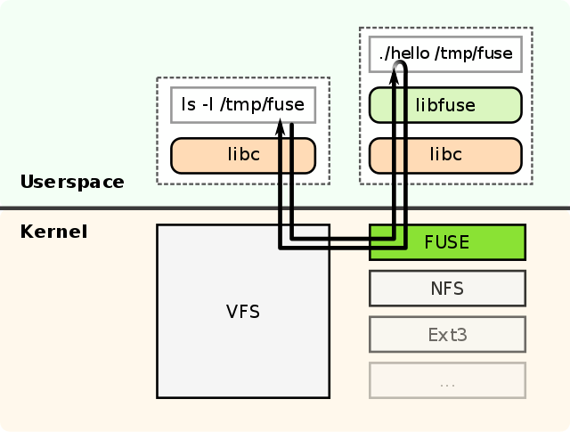

# Tiny Filesystem

Third assignment for 2020 OS course, SSE, Tongji Univ

github@akenonet.com

## Dev Environment

- GNU/Linux 5.7.0 (Arch Linux)
- python 3.8.3
- pip 20.0.2
- libfuse 3.9.2

## Usage

**Important:** This program is only fully compatible with GNU/Linux, before all else, you should make sure that `libfuse` has been appropriately installed and configured, situation and method could very from distro to distro. And you can also build it from source which can be found [here](https://github.com/libfuse/libfuse). All the central goals are:

1. usable lib binaries at correct places
2. successfully loaded kernel module
3. deliberately and appropriately configured filesystem permissions
4. on-demand config files

(Optional) Enable python virtual environment

```bash
python -m venv .venv
. .venv/bin/activate
```

Install dependencies

```bash
pip install -r requirements.txt
```

Initialize your directories manually then mount TinyFS

```bash
python src/tinyfs.py [from_source] [to_target]
```

You can also check your mountpoint with `mount` and `grep` and logging is enabled at `INFO` level by default.

Then you can use this TinyFS with your **coreutils** or graphic/cli file managers.


## How does it work



To implement a new file system, a handler program linked to the supplied `libfuse` library needs to be written. The main purpose of this program is to specify how the file system is to respond to read/write/stat requests. The program is also used to mount the new file system. At the time the file system is mounted, the handler is registered with the kernel. If a user now issues read/write/stat requests for this newly mounted file system, the kernel forwards these IO-requests to the handler and then sends the handler's response back to the user.